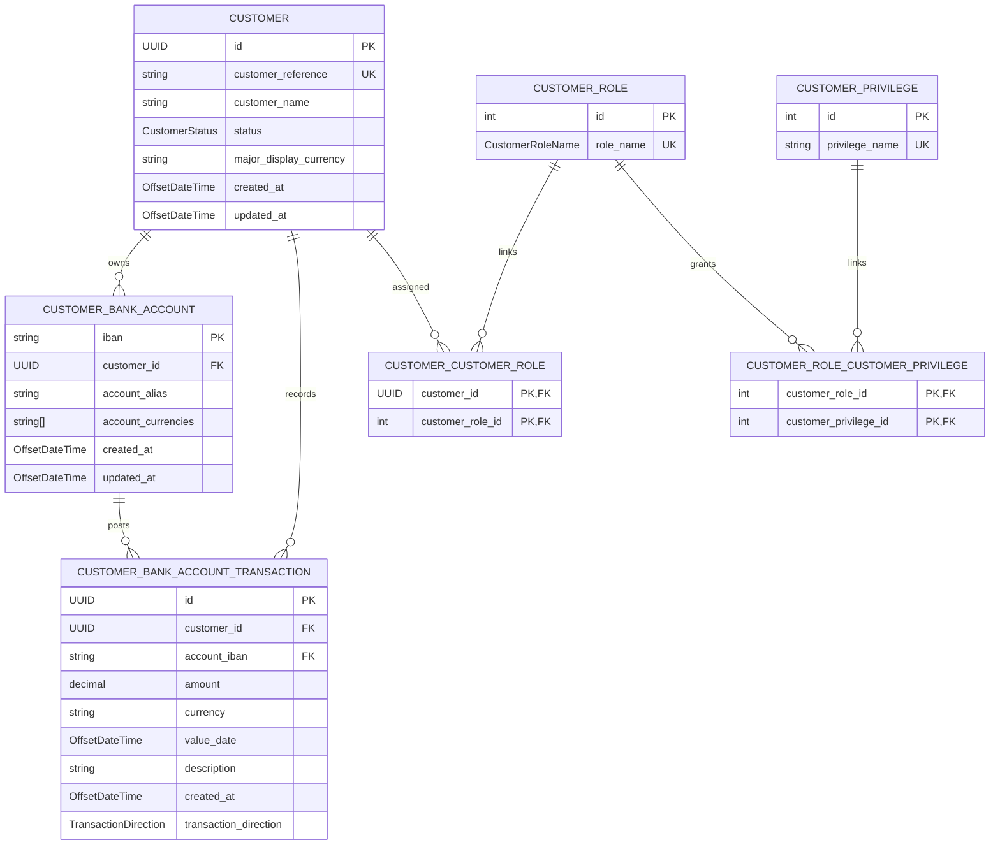

# Database Entities

## Overview

The shared JPA entities under `src/main/java/com/kenc921/dxsp/simple_banking_service/data` model the
core persisted data for the banking service:

- customer identity and status
- bank account ownership and supported currencies
- transaction history
- authorization roles and privileges

These classes are used across the application by the transaction ingestion flow, the authenticated
transaction listing API, and the JWT-based authorization layer. The package is intentionally kept
small and reusable so feature code can share the same persistence model instead of duplicating it.

## Entity Relation Diagram

## Entity Summary

### `Customer`

`Customer` is the root identity record for an authenticated person.

- Primary key: generated `UUID`
- Business key: `customerReference`
- Status: `CustomerStatus` (`ACTIVE` or `INACTIVE`)
- Display preference: `majorDisplayCurrency`
- Relationships:
  - one customer owns many `CustomerBankAccount` records
  - one customer can have many `CustomerRole` assignments through `customer_customer_role`

The authentication layer loads the customer, roles, and privileges from this record set after JWT
validation. The transaction listing API also uses the customer as the root scope for repository
queries.

### `CustomerBankAccount`

`CustomerBankAccount` represents a persisted bank account owned by a customer.

- Primary key: IBAN string
- Ownership: many accounts belong to one `Customer`
- Account metadata: `account_alias`
- Supported currencies: PostgreSQL `varchar(3)[]` stored in `account_currencies`

This entity is used by transaction ingestion to resolve account ownership from the incoming
`accountIban` value. The account relationship is the source of truth for which customer owns a
transaction.

### `CustomerBankAccountTransaction`

`CustomerBankAccountTransaction` stores the transaction history for a customer account.

- Primary key: generated `UUID`
- Relationships:
  - many transactions belong to one `Customer`
  - many transactions belong to one `CustomerBankAccount`
- Monetary data: `amount`, `currency`
- Time data: `valueDate`, `createdAt`
- Classification: `TransactionDirection`

This entity is written by Kafka ingestion and read by the paginated transaction API. The
direction is derived from the amount, with positive values mapped to `CREDIT` and negative values
mapped to `DEBIT`.

### `CustomerRole`

`CustomerRole` stores a reusable authorization role.

- Primary key: generated `Integer`
- Role name: `CustomerRoleName`
- Relationship: many roles can grant many `CustomerPrivilege` records through
  `customer_role_customer_privilege`

The current model uses database-backed roles rather than trusting role claims directly from the
JWT.

### `CustomerPrivilege`

`CustomerPrivilege` stores the fine-grained authority name used by Spring Security.

- Primary key: generated `Integer`
- Unique business field: `privilegeName`

Privileges are attached to roles and then resolved from the database during authentication and
authorization.

## Enum Types

- `CustomerStatus` distinguishes active customers from inactive ones.
- `CustomerRoleName` currently contains `VIEW_ONLY`.
- `TransactionDirection` distinguishes `CREDIT` from `DEBIT`.

## Usage Notes

- Use `Customer` when you need the authenticated user identity or ownership root.
- Use `CustomerBankAccount` when resolving an IBAN or validating account ownership.
- Use `CustomerBankAccountTransaction` when persisting or querying historical transaction data.
- Use `CustomerRole` and `CustomerPrivilege` when dealing with JWT-backed authorization.
- Keep entity-to-schema changes aligned with Liquibase migrations because Hibernate validation is
  configured with `ddl-auto: validate`.

## Local DB Query

To explore database records locally, access pgAdmin at `http://localhost:5050` and execute the
helper queries stored under [testing_tools/sql](../testing_tools/sql).

### pgAdmin Credentials

| Field | Value |
| --- | --- |
| Username | `admin@banking.local.com` |
| Password | `admin` |

### SQL Helper Scripts

| Script | Location | Usage |
| --- | --- | --- |
| `customer_bank_accounts.sql` | [testing_tools/sql/customer_bank_accounts.sql](../testing_tools/sql/customer_bank_accounts.sql) | Lists each customer together with the bank accounts owned by that customer. Use this when you want to inspect IBANs, account aliases, supported currencies, and the customer record behind an account. |
| `customer_transactions.sql` | [testing_tools/sql/customer_transactions.sql](../testing_tools/sql/customer_transactions.sql) | Shows the transaction history for the sample customer reference `P-0123456789`. Use this when you want to inspect transaction direction, amount, currency, value date, and description for the seeded data set. |
| `distinct_role_privilege.sql` | [testing_tools/sql/distinct_role_privilege.sql](../testing_tools/sql/distinct_role_privilege.sql) | Lists the role-to-privilege pairs currently stored in the authorization tables. Use this when you want to verify the database-backed security model. |

The scripts are read-only inspection helpers. They are useful for validating seeded data, checking
entity relationships after local startup, and confirming that the Liquibase state matches the JPA
model.
