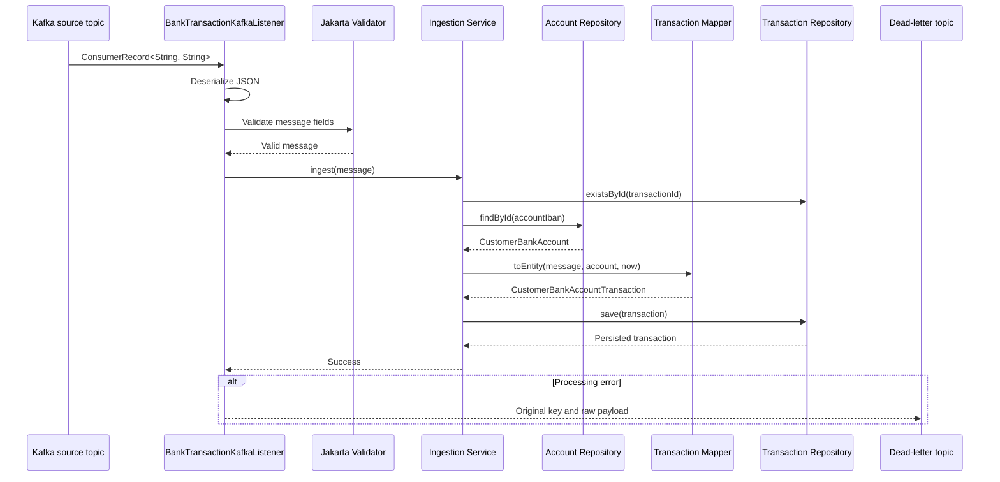
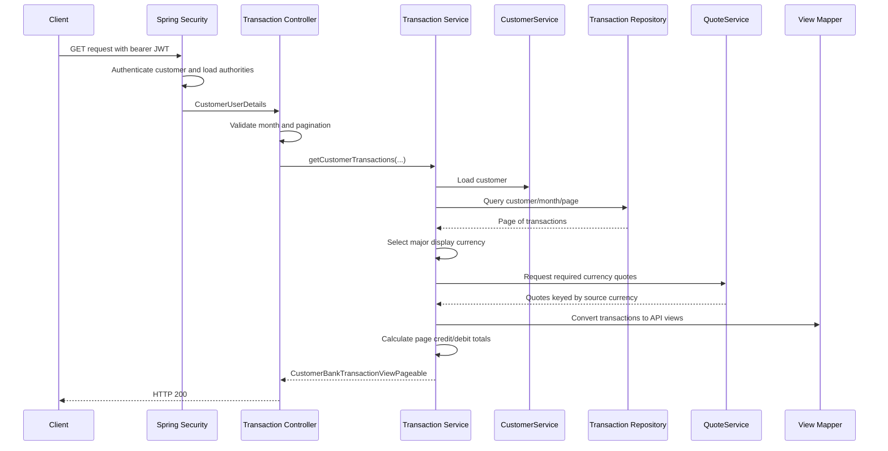

# Transactions Module

## Overview

The transactions module implements the two primary transaction workflows required by the
e-banking portal:

1. Consume account transactions from Kafka and persist valid records.
2. Return an authenticated customer's transactions for a selected calendar month as a paginated
   REST response, including credit and debit totals converted into a major display currency.

The module is organized around clear transport, application-service, mapping, and persistence
boundaries:

- `listener` receives Kafka records and manages message-level failure handling.
- `controller` exposes the customer-facing REST API.
- `service` contains ingestion and transaction-query business logic.
- `repository` provides account lookup and paginated transaction access.
- `model` defines incoming Kafka messages and outgoing API views.
- `model.mapper` converts transport models into persistence entities and API views.

## 1. Incoming Transaction Ingestion

### Entry Point

`BankTransactionKafkaListener#listen` receives transaction events from the Kafka topic configured
by `banking-service.transactions.kafka.topic`.

```java
@KafkaListener(
    topics = "${banking-service.transactions.kafka.topic}",
    groupId = "${spring.kafka.consumer.group-id}",
    containerFactory = "bankTransactionKafkaListenerContainerFactory")
public void listen(ConsumerRecord<String, String> record)
```

The listener consumes `ConsumerRecord<String, String>` rather than a pre-deserialized object. This
is intentional: retaining the original record allows malformed payloads to be logged and published
unchanged to the transaction dead-letter topic.

### Processing Flow



#### 1. Deserialization

The listener uses Jackson's `ObjectMapper` to deserialize the raw JSON value into
`CustomerBankTransactionIncomingMessageDto`.

The DTO defines the transaction ingestion contract:

| Field | Validation |
| --- | --- |
| `transactionId` | Required UUID |
| `accountIban` | Required nonblank string |
| `amount` | Required decimal |
| `currency` | Required three-letter uppercase code |
| `valueDate` | Required timestamp with an offset |
| `description` | Optional, maximum 255 characters |

Deserialization failures are logged with the source topic, partition, offset, key, and raw
payload. The exception is rethrown so that the listener container's transaction-specific error
handler can recover the record.

#### 2. Bean Validation

After deserialization, the listener explicitly invokes Jakarta Bean Validation. Any constraint
violations are collected and raised as a `ConstraintViolationException`.

Validation is performed before database access. This rejects structurally invalid events early and
prevents malformed data from entering the persistence workflow.

#### 3. Transactional Ingestion

`CustomerBankTransactionIncomingMessageIngestionService#ingest` owns the database operation and is
annotated with `@Transactional`. The method performs the following checks and transformations:

1. Reject an amount equal to zero because it cannot be classified as either credit or debit.
2. Check `transactionRepository.existsById(transactionId)` and reject duplicate transaction IDs.
3. Resolve `CustomerBankAccount` using the incoming IBAN.
4. Reject the message if the account does not exist.
5. Map the DTO and resolved account into `CustomerBankAccountTransaction`.
6. Set `createdAt` to `OffsetDateTime.now()`.
7. Save the entity through `CustomerBankAccountTransactionRepository`.

The customer is not accepted directly from the Kafka payload. It is derived from the persisted
account relationship. This prevents an incoming message from assigning a transaction to a customer
that does not own the referenced account.

#### 4. Entity Mapping

`CustomerBankAccountTransactionMapper` maps:

- `transactionId` to the entity ID.
- The resolved account and its customer to the entity relationships.
- Amount, currency, value date, and description from the incoming message.
- The service-supplied ingestion timestamp to `createdAt`.

Transaction direction is derived from the amount:

- Amount greater than zero: `CREDIT`.
- Amount less than zero: `DEBIT`.
- Amount equal to zero: rejected by the service before mapping.

Deriving the direction centrally avoids trusting a producer-supplied direction that could conflict
with the transaction amount.

### Failure and Dead-Letter Handling

`BankTransactionKafkaListenerConfiguration` creates a dedicated listener container factory for
bank transaction ingestion. Its `DefaultErrorHandler` uses a `DeadLetterPublishingRecoverer` and
does not retry failed messages.

Failures caused by malformed JSON, constraint violations, duplicate IDs, unknown IBANs, or database
errors are published to the topic configured by
`banking-service.transactions.kafka.dead-letter-topic`.

The recoverer preserves the original record key and raw value. It also fails explicitly if
dead-letter publication fails, preventing the source record from being treated as successfully
recovered when it has not been retained for investigation.

The error handler is scoped to `bankTransactionKafkaListenerContainerFactory`. An error policy for
transaction ingestion therefore does not implicitly change the behavior of unrelated Kafka
listeners.

### Requirement Significance

This workflow fulfills the requirement that transaction records are consumed from Kafka and made
available to the e-banking API:

- Kafka is the ingestion boundary for account transactions.
- The message contains the required identifier, amount, currency, IBAN, value date, and
  description.
- Database persistence creates a queryable transaction history independently of Kafka retention.
- Duplicate detection supports idempotent handling when the same transaction ID is delivered more
  than once.
- Account lookup establishes customer ownership before persistence.
- Transactional writes prevent a partially completed ingestion operation.
- Raw-message logging and dead-letter publication provide an operational path for diagnosing and
  replaying rejected events.

The requirements state that the Kafka key is the transaction ID. Producers should follow that
contract, but the current listener uses the payload's `transactionId` as the persisted ID and does
not currently verify that the Kafka key and payload ID are equal.

## 2. Paginated Transaction Listing

### Entry Point

`CustomerBankAccountTransactionController#getTransactions` exposes:

```text
GET /api/v1/transactions
```

Request parameters:

| Parameter | Meaning | Validation |
| --- | --- | --- |
| `year` | Calendar year to query | Minimum 1 |
| `month` | Calendar month to query | 1 through 12 |
| `page` | Zero-based page number | Minimum 0; default 0 |
| `size` | Number of records per page | Minimum 1; default 20 |
| `majorDisplayCurrency` | Currency used for converted values and totals | Three uppercase letters |

The controller rejects a requested month later than the current month. Bean Validation handles
numeric and currency-format constraints.

### Authentication and Authorization

The endpoint requires:

```java
@PreAuthorize("hasAuthority('transactions:view')")
```

Spring Security validates the bearer JWT and creates `CustomerUserDetails`. The controller obtains
the customer UUID from the authenticated principal rather than accepting a customer identifier as
a request parameter.

This design prevents horizontal privilege escalation: a caller cannot request another customer's
transactions by changing a URL or query parameter. Database filtering is always based on the
identity established by JWT authentication.

The OpenAPI definition hides the framework-provided authentication principal and documents the
business parameters and expected HTTP responses.

### Query and Aggregation Flow



#### 1. Calendar-Month Boundaries

`CustomerBankAccountTransactionService` converts the requested `YearMonth` into UTC boundaries:

- Start: first day of the month at `00:00:00`.
- End: final day of the month at `LocalTime.MAX`.

`OffsetDateTime` is used consistently between the application and PostgreSQL
`timestamp with time zone` columns. This creates an explicit time-zone policy for month filtering
and avoids dependence on the host machine's default time zone.

#### 2. Customer-Scoped Paginated Query

`CustomerBankAccountTransactionRepository` filters using:

- The authenticated customer UUID.
- `valueDate >= queryStartDate`.
- `valueDate <= queryEndDate`.

Results are ordered by value date descending and then transaction ID descending. The second sort
field provides deterministic ordering when multiple transactions have the same value date.

The repository returns a Spring Data `Page`, so the database fetches only the requested slice while
also returning total-record metadata. The account relationship is fetched in the transaction query
because account alias and IBAN are needed when producing the API view.

#### 3. Major Display Currency Resolution

The service determines the currency used for converted values in this order:

1. Currency supplied by the API request.
2. Customer's configured major display currency.
3. System default from `TransactionConfiguration`.

This precedence allows a caller to request an explicit display currency while retaining stable
customer and system defaults.

#### 4. Exchange-Rate Retrieval

The service extracts the distinct currencies present on the current page and requests only the
required quotes from `QuoteService`.

Quotes are keyed by source, or sell, currency and target the selected major display currency. This
keeps exchange-rate integration behind an interface and prevents the transaction service from
depending on a particular third-party provider or protocol.

The current `DummyQuoteService` returns a fixed test rate. It establishes the intended integration
boundary but must be replaced by a production adapter to satisfy real current-rate behavior,
including provider authentication, timeouts, retries, caching, and failure translation.

#### 5. API View Conversion

`CustomerBankAccountTransactionViewMapper` converts each entity into a response view containing:

- Transaction identifier.
- Original amount and currency.
- Value date, description, creation timestamp, and direction.
- Account alias and IBAN.
- Selected major display currency.
- Amount converted into the major display currency.

When the transaction currency already matches the display currency, the original amount is rounded
to two decimal places. Otherwise, the mapper validates the quote's currency pair, multiplies the
amount by the rate, and rounds the result using `HALF_UP`.

A missing or mismatched quote is treated as an error rather than returning an incorrect converted
amount.

#### 6. Page Totals

After conversion, the service calculates totals over the records in the returned page:

- `pageTotalCredit` sums converted values whose direction is `CREDIT`.
- `pageTotalDebit` sums converted values whose direction is `DEBIT`.

The totals use `BigDecimal` to preserve decimal precision. Under the current sign convention,
credit totals are positive and debit totals are negative because debit transactions retain their
negative amounts after conversion.

The final `CustomerBankTransactionViewPageable` combines transaction content, Spring Data page
metadata, the selected major display currency, and both page totals.

### Requirement Significance

This endpoint directly implements the reusable REST API described in `requirements.md`:

- It returns transactions for an arbitrary, non-future calendar month.
- It scopes every query to the logged-in customer.
- It supports pagination for customers with thousands of monthly transactions.
- It returns account and transaction information across multiple account currencies.
- It converts page values using the exchange-rate service boundary.
- It calculates separate credit and debit totals for the current page.
- It applies both JWT authentication and privilege-based authorization.
- It exposes an OpenAPI-modeled endpoint and validation constraints.
- It separates controller, service, mapping, and data-access responsibilities for maintainability
  and reuse.

## Operational and Data Considerations

- Kafka topic names, consumer group, and dead-letter topic are externalized through application
  configuration.
- Database schema evolution is managed through Liquibase rather than Hibernate DDL generation.
- Transaction IDs provide the primary duplicate-detection mechanism.
- Detailed Kafka error logs include record coordinates and the raw payload.
- The query is paginated and deterministic, but production-scale deployments should maintain a
  database index aligned with customer, value date, and transaction ID filtering and ordering.
- Integration tests should cover PostgreSQL/Liquibase startup, Kafka ingestion and dead-letter
  behavior, authenticated REST requests, pagination, and OpenAPI contract generation.

